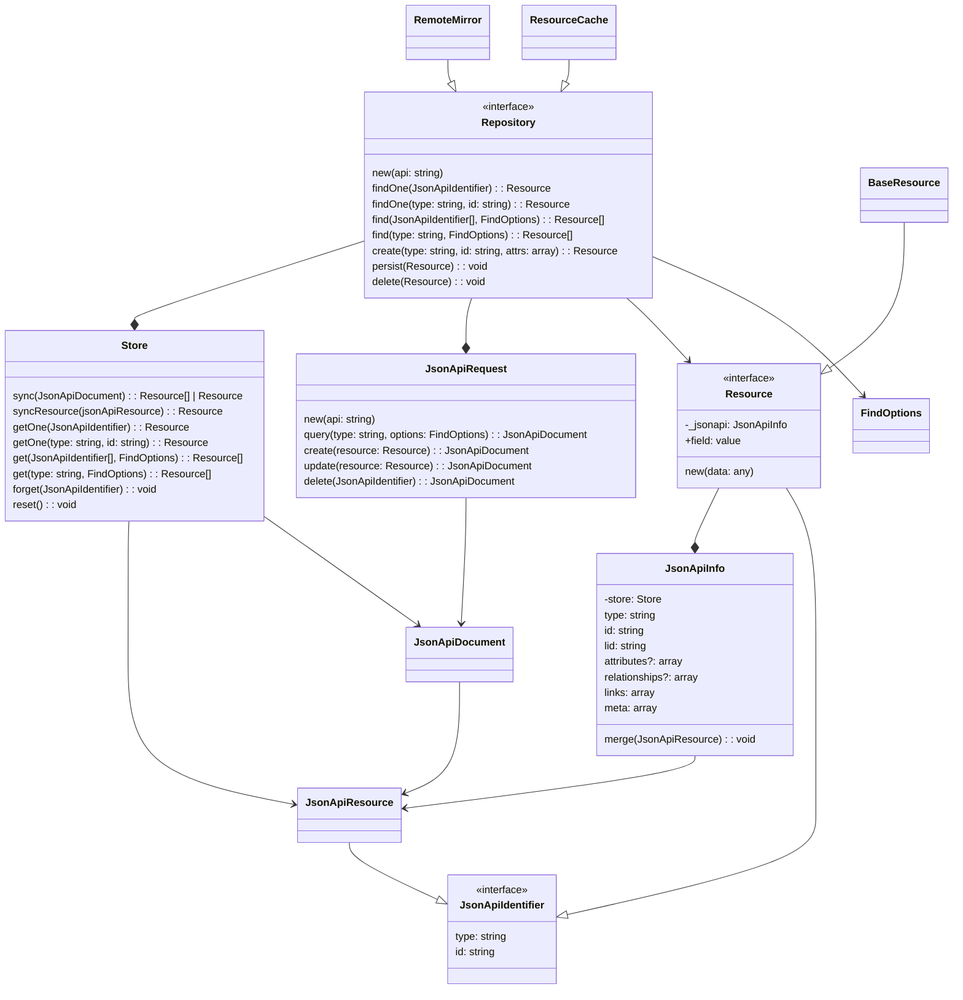

# JsonApi

[JSON:API](https://jsonapi.org) consumer module

## Conceptual schema

```mermaid
classDiagram

Repository --* Store
Repository --* JsonApiRequest
Repository --> Resource
Repository --> FindOptions
Resource --* JsonApiInfo
JsonApiInfo --> JsonApiResource
JsonApiDocument --> JsonApiResource
Store --> JsonApiResource
Store --> JsonApiDocument
JsonApiRequest --> JsonApiDocument
RemoteMirror --|> Repository
ResourceCache --|> Repository
BaseResource --|> Resource
JsonApiResource --|> JsonApiIdentifier
Resource --|> JsonApiIdentifier

class JsonApiIdentifier {
    <<interface>>
    type: string
    id: string
}
class JsonApiResource { }
class JsonApiDocument { }

class JsonApiInfo {
    -store: Store
    type: string
    id: string
    lid: string
    attributes?: array
    relationships?: array
    links: array
    meta: array
    merge(JsonApiResource): void
}

class Resource {
    <<interface>>
    -_jsonapi: JsonApiInfo
    +field: value
    new(data: any)
}

class BaseResource { }

class Store {
    sync(JsonApiDocument): Resource[] | Resource
    syncResource(jsonApiResource): Resource
    getOne(JsonApiIdentifier): Resource
    getOne(type: string, id: string): Resource
    get(JsonApiIdentifier[], FindOptions): Resource[]
    get(type: string, FindOptions): Resource[]
    forget(JsonApiIdentifier): void
    reset(): void
}

class JsonApiRequest {
    new(api: string)
    query(type: string, options: FindOptions): JsonApiDocument
    create(resource: Resource): JsonApiDocument
    update(resource: Resource): JsonApiDocument
    delete(JsonApiIdentifier): JsonApiDocument
}

class Repository {
    <<interface>>
    new(api: string)
    findOne(JsonApiIdentifier): Resource
    findOne(type: string, id: string): Resource
    find(JsonApiIdentifier[], FindOptions): Resource[]
    find(type: string, FindOptions): Resource[]
    create(type: string, id: string, attrs: array): Resource
    persist(Resource): void
    delete(Resource): void
}

class RemoteMirror { }
class ResourceCache { }

class FindOptions { }
```
